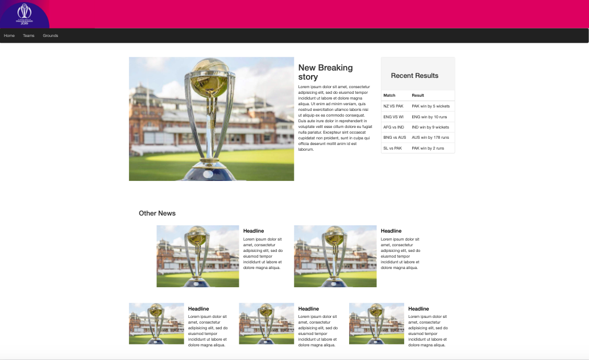
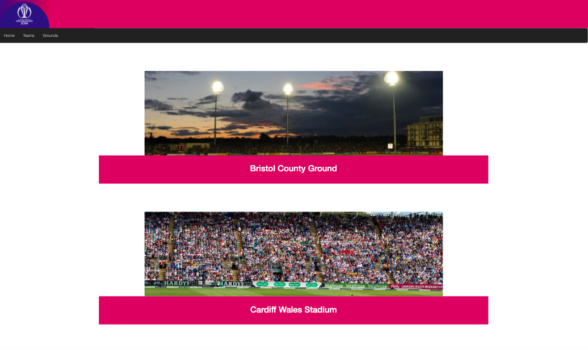

# Sparta-site-project

A responsive 3 page website completed as part of the Sparta Academy training with all the relevant html and css included. This website is an example of what a cricket world cup website could look like.

The files also include the links to the bootstrap css used  to help create the pages.

## Information

 To see this site, download and clone this repo.

## Home Page

## Teams Page

## Grounds Page

